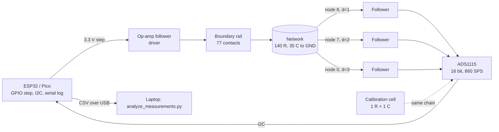

# Garage build, phase 1: measuring the relaxation time of a physical {7,3} network

One week, two boards, one number. The prediction was fixed before the first solder joint
(`PREREGISTRATION_13.md`): the slowest relaxation time of the {7,3} L=2 board is **τ = 2.750·RC** and that of the
square R=6 control **4.551·RC**, ratio **0.604 ± 0.03**. Everything below was simulated first
(`lab/virtual_bench.py`); the acceptance thresholds come from that simulation, not from taste.

Files: `lab/out/BOM.md`, `lab/out/<board>_wiring.md` (solder-order tables), `lab/out/<board>_schematic.pdf`,
`lab/out/<board>_mve.cir` (SPICE), `lab/out/predictions_static.json`, `lab/firmware/step_logger.ino`,
`lab/analyze_measurements.py`.

## 0. Safety and environment (read once, apply always)
- Voltages are 3.3–5 V DC: no electrical hazard. The hazards are the **soldering iron** (burns, fumes: ventilate,
  no lead-free rework in a closed cellar) and **eyes** (clip leads fly: glasses).
- **Cellar humidity** is the one environmental threat to the measurement: surface leakage on damp perfboard is a
  parallel resistance to every capacitor. With 100 kΩ resistors a leakage path of 10 MΩ changes τ by 1 %. Store the
  boards in a sealed box with silica gel; measure at the same temperature (note it: a 1 % resistor batch drifts
  ~100 ppm/K, negligible; film capacitors ~200 ppm/K, negligible; leakage is not).
- ESD: film capacitors and resistors don't care; the op-amp and ADC do. Touch ground before handling them.

## 1. Why this design (each choice is a simulation result)
| Choice | Reason |
|---|---|
| R = 100 kΩ, C = 1 µF, RC = 0.1 s | τ ≈ 0.28 s / 0.46 s: slow enough for an 860 S/s ADC and a microcontroller, fast enough for 5 records in a minute |
| Film capacitors (PET/PP) or C0G | class-2 ceramics lose 20–50 % of C under DC bias; electrolytics leak. Either would shift τ by far more than the 3 % band |
| 1 % resistors | true τ of a board with 1 % parts is within 0.3 % of nominal; with 5 % R and 10 % C, within 2.7 %, which eats the whole band |
| One driven rail, three probes | the slowest mode is excited by any step; no need for 77 independent channels (that is phase 2) |
| Unity-gain buffers (rail-to-rail op-amp) | a 100 kΩ source must not be loaded by the ADC's ~MΩ input (1 % error) nor by a GPIO's drive |
| 16-bit ADC (ADS1115), ≥ 100 S/s per channel | the fit window is 1–10 % of a 3.3 V step, i.e. 33–330 mV: at 10 bits that is 8–80 LSB and the fit error was +20 % to +80 % in simulation; at 12 bits ≤ 0.3 %, at 16 bits ≤ 0.1 % |
| Fit window y/V0 ∈ [0.01, 0.10] | the second mode decays only 2× (hyperbolic) / 2.5× (square) faster than the slowest; a 2–30 % window gave −2.5 % / −6 % bias |
| Calibration cell (1 R + 1 C per board) | measures RC directly with the same chain; the predictions are pure numbers times τ_cal |

## 2. The measurement chain



Signal: the rail steps from 0 to 3.3 V at t = 0; each interior node charges toward 3.3 V; the deepest probe starts
with **zero slope** (S-shaped onset), which is expected, not a fault. Record 8 s, then hold the rail at 0 V for ≥ 8 s
to discharge before the next record.

## 3. Board layout

Use the schematic PDF as the placement drawing: put components where the drawing puts them (Poincaré-disk layout
for {7,3}, square grid for the control), boundary contacts on the outer ring joined by a bus wire (the rail), ground
bus underneath, one capacitor from every interior node to ground. Solder from the centre outward, following
`<board>_wiring.md` (deepest class first), and check each resistor with the DMM before the next row.

```mermaid
flowchart TB
  subgraph {7,3} L=2 board
    C0[centre heptagon<br/>7 nodes, depth 3] --- D2[depth 2 ring<br/>7 nodes] --- D1[depth 1 ring<br/>21 nodes] --- B[boundary ring<br/>77 contacts = rail]
  end
  GND[ground bus] -.35 capacitors.- C0 & D2 & D1
```

## 4. The week

| Day | Work | Gate to pass before the next day |
|---|---|---|
| **1 · Design freeze** | Read this guide and `PREREGISTRATION_13.md`. Run `python3 lab/bom_and_netlist.py` and `python3 lab/virtual_bench.py`; open the schematics; run `python3 lab/analyze_measurements.py --demo` to see the whole pipeline work on synthetic records. Optional: load `*_mve.cir` in ngspice/LTspice and check τ against `predictions_static.json`. | The demo prints `T1_ratio: True`, `T2: True`. Nothing bought yet. |
| **2 · Parts and sorting** | Buy per `BOM.md`. Measure every resistor and capacitor with the DMM (G1: R within 2 %, C within 10 %); sort into two piles, one per board, from the same batches; keep 2 R + 2 C for the calibration cells. Record the measured values in `lab/data/components.csv` (id, nominal, measured). | G1 passes; the component file exists. |
| **3 · Build {7,3} L=2** | Perfboard, schematic as placement. Solder per `hyp73_L2_wiring.md`, DMM check every row. Add the calibration cell and the three probe pads (nodes 8, 7, 0), rail and ground buses. | Static check G2: DMM between the 6 boundary pairs of `predictions_static.json` within 3 % for ≥ 5 pairs. If not, find the wiring error with the netlist before going on. |
| **4 · Build square R=6** | Same, per `square_R6_wiring.md` (200 R, 69 C, probes 10, 20, 31). | G2 on the square board. |
| **5 · Chain and firmware** | Wire op-amp followers (driver + 3 probes), ADS1115, ESP32; flash `step_logger.ino`; test on the **calibration cell alone**: 5 records, fit τ_cal. | G4: τ_cal within 5 % of 0.100 s, records repeatable within 1 %. If τ_cal is off by more than 5 %, the chain (not the boards) is wrong: check buffer supply rails, ADC gain, the C value. |
| **6 · Measure** | Per board: 5 step records at the same temperature; record temperature and humidity. Put the CSVs under `lab/data/` and fill `lab/data/h4_records.json`; run `python3 lab/analyze_measurements.py`. Do not look at the predictions while measuring; the script compares. | G3 (probes agree within 3 %); the script writes `lab/data/h4_step_response.json` with verdicts. |
| **7 · Record and report** | RUNBOOK steps 6–8: claim `H4-X-0001` with `tools/ledger_add.py`, `tools/experiment_gate.py` (it checks the preregistration was committed before the data), results block in `LAB_RESULTS.md`. Whatever the verdict. | `ALL PASS`; committed; the human reads the result before anyone interprets it. |

If a day slips, the gates do not move: a board that fails G2 is not measured.

## 5. Data format (what the logger writes, what the analysis reads)
- One CSV per record: `t_s,ch0,ch1,ch2`, t from the step in seconds, channels in volts, 8 s at ~280 S/s per channel.
- `lab/data/h4_records.json`: `{"V0": 3.3, "boards": {"{7,3} L=2": {"records": [...], "calibration_records": [...],
  "probe_nodes": [8,7,0], "temperature_C": .., "humidity_pct": ..}, "square R=6": {...}},
  "static_ohms": {"{7,3} L=2": [{"boundary_i":..,"boundary_j":..,"R_meas_ohm":..}, ...], ...}}`
- Output `lab/data/h4_step_response.json`: τ per record and per board, τ_cal, ratio, static comparison, verdicts.

## 6. What could go wrong, and what each symptom means
| Symptom | Likely cause | Check |
|---|---|---|
| τ_cal fine, board τ too **long** | leakage is not it (leakage shortens τ); an open resistor (deep node isolated) or a missing capacitor's neighbour | G2 static pairs; DMM the suspect row |
| board τ too **short** | leakage (humidity) or a class-2 ceramic capacitor | dry the board, remeasure; check capacitor type |
| probes disagree by > 3 % | one probe buffer oscillating or loading; or a probe on the wrong node | scope the buffer output; DMM continuity of the probe pad |
| S-shaped onset on the deep probe | expected | none |
| records drift over minutes | thermal (unlikely at 1 %) or incomplete discharge between records | wait ≥ 8 s at 0 V; hold temperature |
| ratio fine, absolute τ off | calibration cell parts not from the same batch, or ADC gain | remeasure the cell's R and C |

## 7. Phase 2 (not this week; its own preregistration)
The static Neumann-to-Dirichlet map (a 77-channel multiplexed injection, 5 × CD74HC4067), the defect experiments
(single-node ×2 contrast, differential measurement: the simulations say 5 % parts are enough and localisation holds
to ≥ 10⁻¹ noise on this board), and a second {7,3} board with a built-in switchable defect. Phase 1's chain (buffers,
ADC, logger) is reused.

## 8. Reporting rule
Numbers go from `h4_step_response.json` into `LAB_RESULTS.md` and the ledger; none is typed from memory. A refuted
prediction is reported with the same prominence as a confirmed one, with the suspected cause from §6, and the
decision about what to change is a human's.
